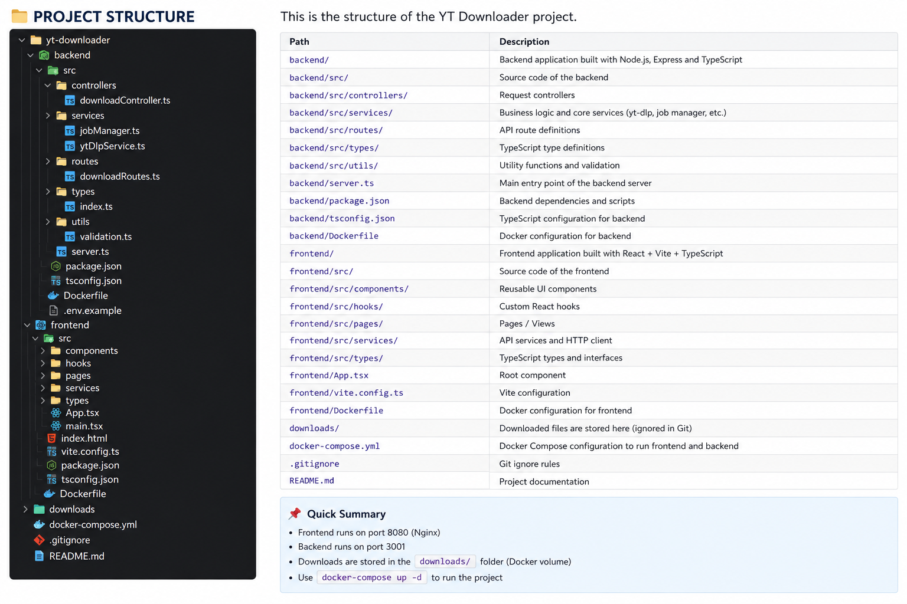

<p align="center">
  
</p>

# 🎬 YT Downloader

A modern full-stack YouTube/media downloader built with **React, TypeScript, Node.js, Express, yt-dlp, and Docker**.

The application provides a web-based interface for analyzing video URLs, selecting download quality, managing download jobs, tracking playlist progress, filtering duplicate videos, and saving completed files to a user-selected folder.


## 🚀 Features

### 🎥 Video Download

- Paste a YouTube/media URL
- Analyze video information before downloading
- Select download quality
- Supports:
  - Best Quality
  - 4K
  - 1080p
  - 720p
  - 480p
  - 360p
  - Audio

### 📋 Playlist Download

- Playlist support
- Playlist progress tracking
- Current video counter
- Completed video counter
- Skipped video counter
- Displays:
  - `Current Video / Total Videos`
  - Current video title
  - Download progress
  - Download speed
  - ETA

### 🛡️ Duplicate Filtering

The application prevents unnecessary duplicate downloads.

Duplicate detection is performed using:

- Video ID
- Normalized video title
- Existing downloaded files

This prevents the same video from being downloaded multiple times from a playlist.

### 📊 Download Management

Download jobs support:

- Queued
- Analyzing
- Downloading
- Processing
- Completed
- Failed
- Cancelled

Users can:

- View download progress
- Cancel downloads
- Retry failed downloads
- Remove download jobs
- View completed files

### 📁 Custom Download Location

The frontend supports browser-based folder selection.

The user can:

1. Click **Download**
2. Select a Windows folder
3. Start the download
4. Save the completed file to the selected folder

This uses the browser's File System Access API where supported.

> Google Chrome and Microsoft Edge desktop provide the best support for folder selection.

### 🐳 Docker Support

The project is containerized using Docker.

Services:

- Frontend
- Backend

Docker Compose is used to run the complete application.

---

# 🏗️ Architecture


                    ┌──────────────────────┐
                    │      Web Browser     │
                    │   React Frontend     │
                    │    Port: 8080        │
                    └──────────┬───────────┘
                               │
                               │ HTTP / REST API
                               ▼
                    ┌──────────────────────┐
                    │       Backend        │
                    │ Node.js + Express    │
                    │    Port: 3001        │
                    └──────────┬───────────┘
                               │
                               ▼
                    ┌──────────────────────┐
                    │       yt-dlp         │
                    │ Video Downloader     │
                    └──────────┬───────────┘
                               │
                               ▼
                    ┌──────────────────────┐
                    │ Download Storage     │
                    │   Docker Volume      │
                    └──────────────────────┘
    
## 🐳 Docker Installation

This project uses Docker to run the frontend and backend as separate containers.

### Docker Images

The project contains two Docker images:

| Image | Purpose | Port |
|---|---|---:|
| `yt-downloader-frontend:latest` | React + Vite frontend served with Nginx | `8080` |
| `yt-downloader-backend:latest` | Node.js + Express + yt-dlp backend | `3001` |

### Build Docker Images

From the project root:

```bash
docker compose build

## 📥 Clone the Repository

Clone the project from GitHub:

```bash
git clone https://github.com/Vishwajeet1112/yt-downloader.git

cd yt-downloader


🌐 Open the Application

Frontend:

http://localhost:8080

Backend:

http://localhost:3001